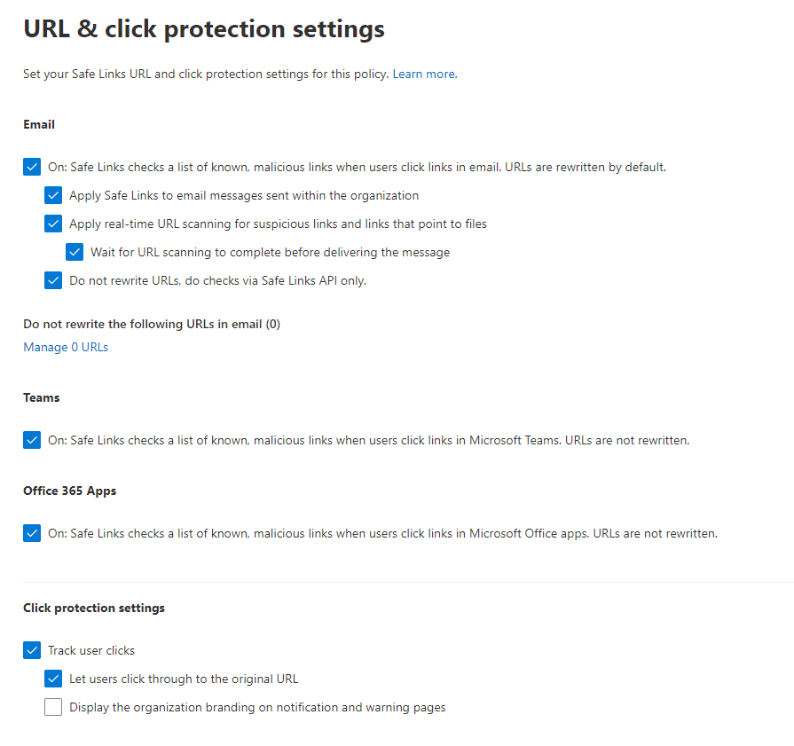

# CyberDyne

## Introduksjon 

I dette dokumentet så skal jeg først vise oppsettet til cyberdyne slik jeg laget det i powershell. Deretter så skal jeg gå gjennom hvordan kan vi sikre office365 for cyberdyne med mest mulig forklaringer for innstillingene som skal implementeres.

 

## Oppsett

 
 

## Flow 

 
 

## Sikkerhet

Microsoft office og exchange har sikkerhets verktøy som forhindrer skadelige epost å nå fram til ansatte, som *Microsoft defender for office* og *Exchange online protection*.
Eop er en skybasert filteringstjeneste som beskytter brukernes epost mot spam og malware. Dette betyr at:
* Hvis den epost inneholder skadelig programvare så blir den identifisert og behandlet i henhold til policyer.
* Hvis en epost melding har høy sannsynlighet for at den er spam, så blir den identifisert og behandlet i henhold til policyer.

De overnevnte punktene er baseline default sikkerhet (built-in protection) i EOP, og sikkerheten kan justeres og strammes etter bedriftens behov og policyer. I tillegg så tilbyr microsoft to policymaler 'Standard' og 'Strict' som aktiverer de mest anbefalte sikkerhetsinstillinger som vi skal gå gjennom. Jeg ville aktivere standard preset for alle brukere, og strict for admins siden de har høyere privligier.

### Anti-phishing

Policies: 

Det jeg ville ha gjort her er å øke sensitiviteten på phishing meldinger fra standard til aggressive. Det vil gjøre at medlinger som med medium sansynliget blir filtrert som de er phishing. 

Når det gjelder 'impersonation', etter å ha aktivert den for brukere og domener, så ville f jeg lagge til domener jeg eier, noe som kan varsle hvis det skjer imitering av de domenene. Hvis det er domener som Cyberdyne ikke eier, men ofte samhandler med, så er det lurt å legge de i 'include custom domains' delen. 
Hvis det også er domener med høy tillit som Cybercyne ofte samhandler med som kan bli flagget som impersonation med uhell så kan de bli lagt til trusted domains hvis det er behov for det.

Jeg vil også lage en ny strengere phising policy hvor jeg legger admins som ofte sender meldinger, som 'CEO', i beskytede brukere for imitering. Disse brukerne med nøkkel roller er ofte et mål for angriperne å etterligne, for å lure de andre med at meldingen er reel.

Actions: 

Før vi går til actions så må vi skru på 'Enable intelligence for impersonation protection' for å kunne gjøre en 'action' når det blir oppdaget en immitert phishing melding. Da kan vi gjøre at etterlignede og spoofed meldinger går i karantene så kan de blir studert videre av it-admin. Det er også lurt å hooke av 'Show first conatact safety ip'. Denne delen gjør at hvis en bruker mottar en melding fra en sender for første gangen så blir denne brukeren varslet.

 

### Anti-Malware

I EOP, alle meldinger som inneholder skadelig programvare blir satt i karantene, og blir kontrollert i henhold til policyene. Anti-maleware policyene justerer instillingene og varslingsalternativene når skadelig innhold blir oppdaget. 

Policies:

Det vi kan starte med er å enable 'Enable the common attachments filter'. Denne instillingen gjør at vedlegg med kjørbare filer og 'scripts' av type cmd, msi, exe osv blir blokkert siden man ikke skal bruke exchange online for å overføre sånne type filer i utgangspunktet.

*Zero hour auto purge (ZAP)* gjør at signaturen til malware blir gjenkjent basert på kjente malware signaturer som microsoft har registrert. Denne instillingen er aktivert by default så vi kan bare la den være på. Det er også lurt å la karantenepolicy være 'AdminOnly' slik at bare administratoren kan kontrollere meldinger i karantene. 

Til slutt så kan vi krysse av 'Send notifications til admin' for både interne og eksterne meldinger for å holde administratorer oppdatert på hacking forsøk dersom det forekommer. 

 

### Safe Attachments in Defender for Office 365

Denne gir et ekstra lag av beskyttelse til vedlegg som blir sendt etter å ha blitt skannet av anti-malware i EOP. Denne delen er aktivert by default i built-in protection.

Policies:

De defaulte policyene i built-in protection bør være tilstrekelige for beskyttesle mot skadelige vedlegg, og hvis et skadelig vedlegg blir oppdaget så blir det satt i karantene.
Det vi kan legge inn her er omdirigere epost meldinger med skadelige vedlegg til it-admin eller sikkerhetsansvarlig for å sjekke dem videre, noe som hjelper med å sikre bedriften.

 

### Safe Links

Safe links er en funksjon som tilbys av defender for office 365 som gjør at innkommende epost blir skannet for skadelige lenker og skriver om disse for å sikre at de ikke blir åpnet.

Policies: 

Safe links er aktivert by default via Built-in protection med de tilstrekkelige instillinger for å beskytte tenanten mot skadelige lenker. Men kan legge lenker man ikke vil skrive om i "Do not rewrite the following URLs in email" delen.

 

### Anti-spam (mail filtering)

 I dag er det veldig vanlig å motta ganske mange spam meldinger som fort kan fylle mailbokesen. EOP tilbyr en anti-spam tjeneste som identifiserer spam meldinger og legger dem i junk mappen, noe som hjelper med å skille spam meldinger fra legetime meldinger. Den identifiserer epost kilder gjennom 'Ip allow list', 'Ip block list' og 'safe list' som oppdateres dynamisk fra microsoft, men man kan selfølgelig legge flere ip adresser her.

Anti-spam har 3 forskjellige policyer som er aktivert by default, men trenger litt konfigurasjon.

 

1. Anti-spam inbound: 

Policies:

Det første jeg vil gjøre her er å flytte Bulk spam score fra 7 til 6. Bulk spam er spam som er mindre kjent som spam og litt vanskeligere å identifisere, som for eksempel engangsannonser. Å ha den på 6 gjør at flere av disse blir identifisert som spam og blir flyttet til junk mappen.

Resten av instillinger valgfrie og varierer fra bedrift til bedrift basert bedriftens driftsenario. Man kan fks blokkere/inkudere epost som har html tags i den som spam eller epost fra et spesifikt land. Hvis man er usikker på hvordan det går utover innkommende meldinger så kan man velge 'test mode' og enten legge en X header på meldingene eller omdirigere dem til sikkerhetsansvalig for videre forskning. 

Actions: 

Her kan vi velge at 'High confidence spam' og 'Phishing detection action' blir satt i karentene isteden for å bli flyttet til junk siden de kan være oppriktige meldinger. Vi setter 'Retain spam in quarantine' til 30 dager.

I 'allow & block list' kan vi spesifisere etter behov som fks å tillate/blokkere meldinger fra et helt domene eller spesifikke brukere.

 

2. Anti-spam outbound:

Denne delen setter restriksjoner på meldinger som sendes fra bedriften. Det er lurt å sette en begrensing på dem i tilfelle fks en av brukerkontoene ble hacket og angreperen bruker dem til å sende spam/phishing epost til andre noe som kan føre til at bedriftens domene blir svartlistet. Policyene kan variere fra bedrift til bedrift men i den delen så skal vi følge [Microsoft](https://learn.microsoft.com/en-us/microsoft-365/security/office-365-security/recommended-settings-for-eop-and-office365?view=o365-worldwide#asf-settings-in-anti-spam-policies) sine anbefalinger.

policies:

Set an external message limit: Denne setter begrensning på hvor mange meldinger det er lov å sende eksternt per time. Vi begrenser dem til 500.

Set an internal message limit: Denne setter begrensning på hvor mange meldinger det er lov å sende internt per time. Vi begrenser dem til 1000.

Set a daily message limit: Denne setter begrensning på hvor mange meldinger det er lov å sende per dag. Vi begrenser dem til 1000.

Til slutt så velger vi at brukeren blir blokkert hvis vedkommende overgår begrensingene, og varsler IT-admin om at denne brukeren blir blokkert.

 

3. Anti-spam filter policy

Her kan man legge til ip adresser enten om de skal bli blokkert eller at de skal slippe gjennom filteret. Her er det lurt å tilate bedriftens interne ip adresse range som fks 192.168.0.1-192.168.0.254, men man må huske å aktivere 'Turn on safe list' for å få dette til å funke. Man kan også velge å legge ip adresser som man vil identifisere som spam i block list.

 

 

### Mail flow rules

Her kan man legge noen epost sikkerhetsregler basert på kreterier som man kan spesifisere selv. For eksempel kan man spesifisere at hvis en ekstern bruker utgir seg til å være en admin så blir dem blokkert eller videre sendt til sikkerhetsansvarlig.

 

### Sharepoint

I opperetelsen av sharepoint så valgte jeg å sette gruppene til privat så er det kun ansatte i avdelingen som for lov til å se innholdet på siten, siden jeg antatt at det ikke er nødvedlig for medlemmer i andre avdelinger å se innholdet. 

#### Sharing

Standard innstilling til deling er satt til 'anyone' noe som kan være skummelt. Jeg velger å sette den til 'new and Existing guests' som betyr at man kan dele innhold til kun interne brukere og guests. Jeg velger å ha gjester med i tillfelle det er sammarbeidspartnere som bedriften vil dele ressurs med.

#### Access control

I 'Unmanaged devices' og 'Network location' delen så kan vi la det være på full access slik at ansatte kan bruke sine private datamaskiner og mobilteleforner for å bruke sharepoint.
Siden det finnes applikasjoner som ikke bruker tilfredsstillende autentisering så er det hensiktsmessig å blokkere innlogging fra slike kilder. 
Tilslutt så kan vi aktivere 'idle session sign out'. Dette vil tvinge fram regelmessig autentisering, i tillegg til å forhindre uautentirisert tilgang til siten.

## Kilder

Pensum

https://learn.microsoft.com/en-us/microsoft-365/security/office-365-security/?view=o365-worldwide

https://learn.microsoft.com/en-us/microsoft-365/security/office-365-security/tenant-wide-setup-for-increased-security?view=o365-worldwide (og sites inni hver del)
