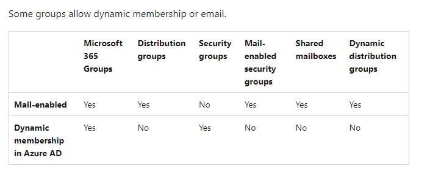
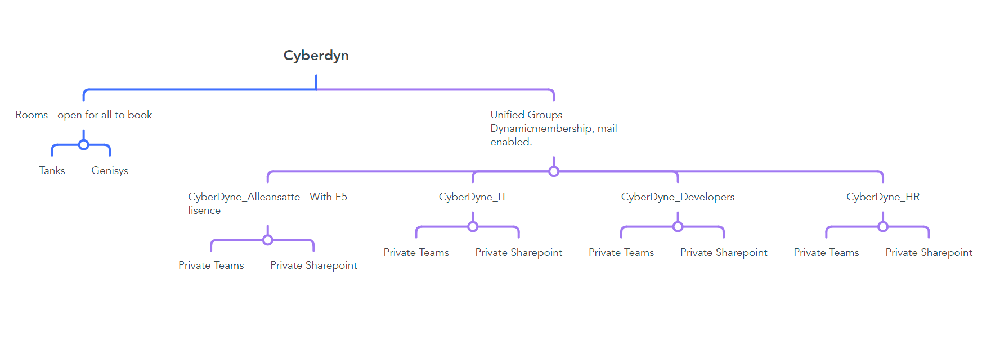

## oppsette

Ettersom det ble stilt krav om teams og sharepoint for å få lagene til å samarbeide, så er det krav med å opprette en m365 gruppe for hvert lag i tillegg til en gruppe for de alle ansatte. Microsoft tillater at m365 gruppe skal vare både *'security enabled'* og *'mailbox enabled'*

## Flow 

Når en administrator lager en brukerkonto til en ansatt så blir denne brukeren dynamisk lagt til gruppen som er for alle ansatte, og lagt til gruppen for avdelingen han tilhører til, og naturligvis blir lagt til sharepoint og teams som er hektet til denne gruppen. Brukeren får også arve E5 lisensen fra gruppen for alle brukere som gjør det mulig for brukeren å få tilgang til essensielle office applikasjoner. 

